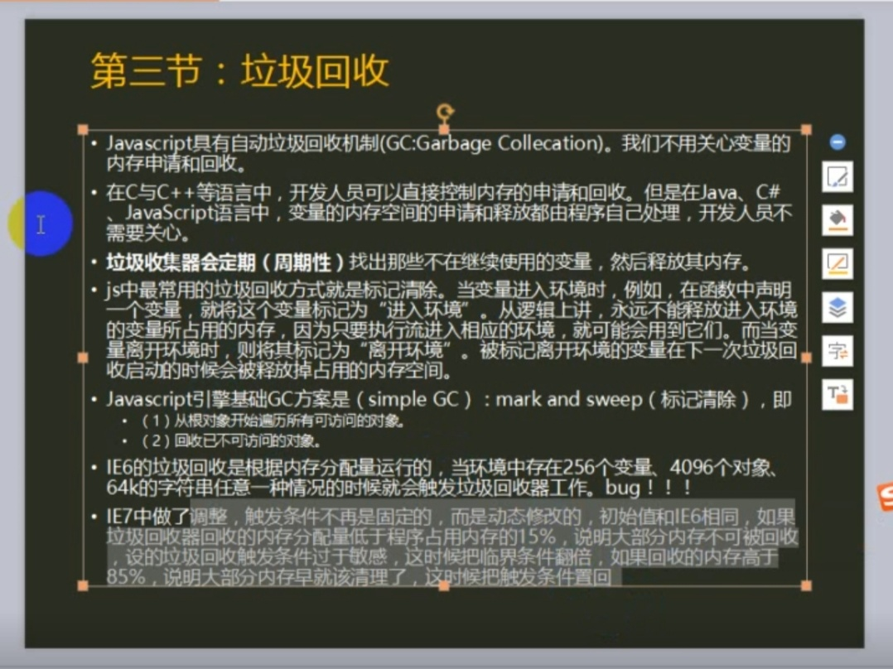

#  机制



#  应用
- 数组的清零 
arr = [1,2,4,5 ,6];  
arr = null; // 不好，因为又新建了一个对象  
arr = []; // 不好，因为相当于在内存中新建了一个空数组，再让arr指向那个空数组，而原来的数据还占用内存并等待回收
arr.length = 0; //最好

- 对象复用
```
var t = {};
for(var i = 0; i < 10; i ++){
  //var t = {}; 假如在这里声明的话每一次循环都会创建一个新的空对象，所以最好在循环外声明
  t.age = 100;
  t.name = 'zho';
  console.log(t);
};
t = null; // 如果对象不用了立刻设置成null
```
