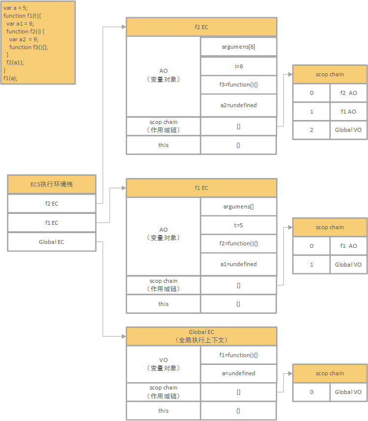

# 1、函数执行上下文（也叫函数执行环境）
  
# 2、JS原型链

# 3、
``` 
function Animal(){};
function Cat(){}; 

function object(o){
    	var F = function(){};
    	F.prototype = o;
    	return new F();
}

// 创建一个对象t，t的原型是o(其实也就是t的_proto_指向了o？)，然后为t设置一个constructor属性，并且指向Cat
function inheritFrom(o){
    	var t = object(o);
    	t.constructor = Cat;
    	return t;
}
Cat.prototype = inheritFrom(Animal.prototype);
//inheritFrom(Animal.prototype) 创建一个对象t，t的原型是Animal，所以t继承了Animal.prototype的所有方法和属性;并且t的constructor指向了Cat
//Cat.prototype = t 这样t就成了Cat的真真正正的prototype
//因为t 的constructor指向了Cat(),而Cat的prototype指向了t

//CON 此时的Cat()创造的对象是以t为原型的对象，同时t的原型是Animal.prototype
//所以var cat1 = new Cat() 既有自己的独特Cat原型，同时也继承了Animal.prototype,也就是说
// cat1拥有了Animal的一般特性，又保持了自己的特殊性
```